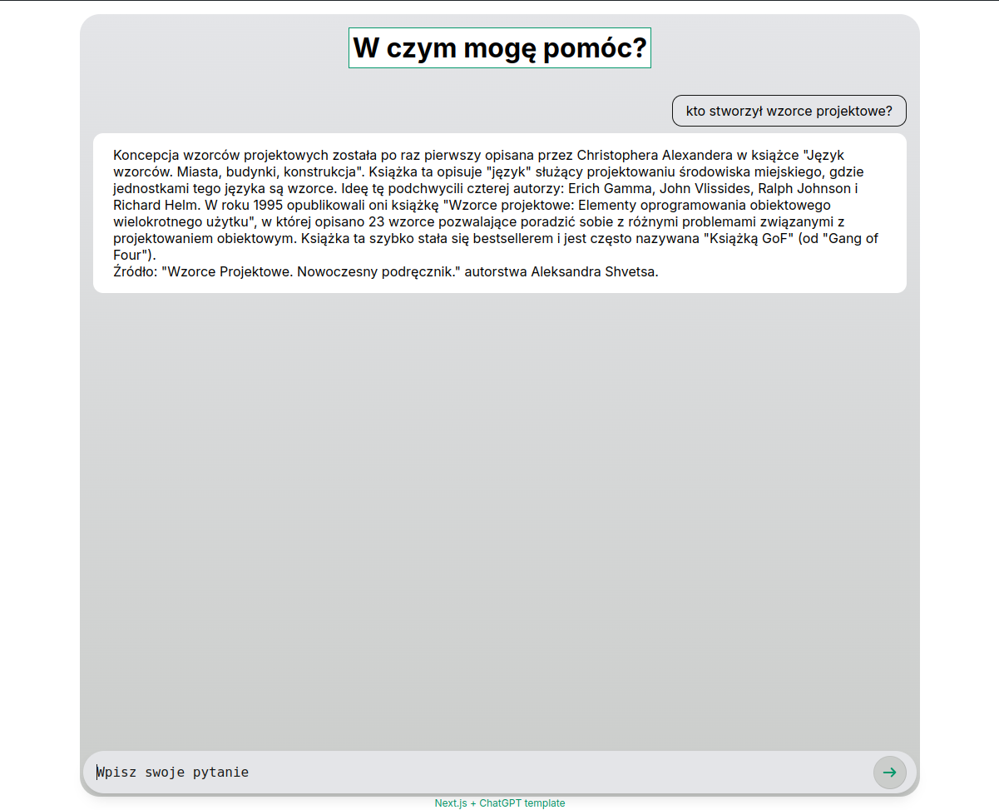
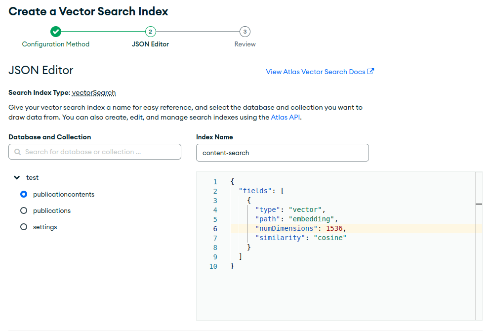

## Next.js + ChatGPT template

This example application demonstrates the integration of Next.js with the OpenAI API (ChatGPT), showcasing advanced features including:
- Real-time message streaming
- Answer generation based on provided sources



## Getting Started

First, install everything:

```bash
npm install
```

Add .env file with openAI api key and mongodb connection string:

```
OPENAI_API_KEY=
DATABASE_CONNECTION_STRING=
```


Run the development server:

```bash
npm run dev
```

## How it works

The application operates by deriving answers from provided sources. Upon adding sources to the database, they are segmented into content parts, and an embedding is generated for each segment. Embeddings consist of arrays of numerical coordinates representing vectors within a multidimensional space. When a user poses a question, it is similarly converted into an embedding. The application then employs vector search across the database to identify the most relevant matches. Subsequently, the content from identified source segments and the question are utilized, guided by predefined instructions, to formulate an answer.

### Steps to Achieve Functionality:

1. Source Integration:
- Add relevant sources to the application's database.
- Segment each source into discrete content parts.

2. Embedding Generation:
- Generate embeddings for each content part using multidimensional arrays.
- Store these embeddings in association with their respective content parts.

3. User Query Handling:
- Convert user questions into embeddings.
- Utilize vector search across the database to locate content parts with embeddings closest to the user query's embedding.

4. Answer Formulation:
- Retrieve the content from the matched source segments.
- Combine the content with the original question and follow predefined instructions to formulate and present an answer.


## Database setup

This application requires MongoDB database. To run a vector search on a database a vector search index is required. 

1. Add a vector search index, name it `content-search`
2. It should be created on a `publicationcontents` collection
3. Set its configuration as:
```json
{
  "fields": [
    {
      "numDimensions": 1536,
      "path": "embedding",
      "similarity": "cosine",
      "type": "vector"
    }
  ]
}
```
It means that there will be a vector search based on a cosine similarity done on an embedding field.



All names can be changed, but it will require to apply changes to the application code as well.

## API

### Create Publication
- Endpoint: `/api/publications`
- Method: POST
- Description: Creates a new publication.
- Request Body: (JSON):
```json
{
  "name": "Wzorce Projektowe. Nowoczesny podręcznik.",
  "authors": ["Aleksander Shvets"]
}
```
- Response: Returns a JSON object with details of the created publication. For example:
```json
{
    "message": "Publication added",
    "result": {
        "name": "Wzorce Projektowe. Nowoczesny podręcznik.",
        "authors": [
            "Aleksander Shvets"
        ],
        "_id": "667d4233b77769c93520b797",
        "createdAt": "2024-06-27T10:42:59.429Z",
        "updatedAt": "2024-06-27T10:42:59.429Z",
        "__v": 0
    }
}
```

### Create Publication Content
- Endpoint: `/api/contents`
- Method: POST
- Description: Adds content to an existing publication. For bigger documents it is recommended to use `multiple: true` to split the content into multiple objects. First create a publication and use the created publication id.
- Request Body: (JSON):
```json
{
  "publicationId": "667d4233b77769c93520b797",
  "multiple": true,
  "content": "Detailed content goes here..."
}
```
- Response: Returns a JSON object with details of the created content, for example:
```json
{
    "message": "Publications added",
    "count": 5
}
```

### Get Settings
- Endpoint: `/api/settings`
- Method: GET
- Description: Retrieves the application settings.
- Response: Returns a JSON object with current settings.

### Get Publications List
- Endpoint: `/api/publications`
- Method: GET
- Description: Retrieves a list of all publications.
- Response: Returns a JSON array of publications.

### Send Chat Query
- Endpoint: `/api/chat`
- Method: POST
- Description: Sends a query message for chat processing.
- Response: Returns a JSON object with the chat response.

### Update Settings
- Endpoint: `/api/settings`
- Method: PUT
- Description: Updates the application settings.
- Request Body: (JSON):
```json
{
  "model": "gpt-4o",
  "match_quality": 75
}
```
- Response: Returns a JSON object with updated settings.
